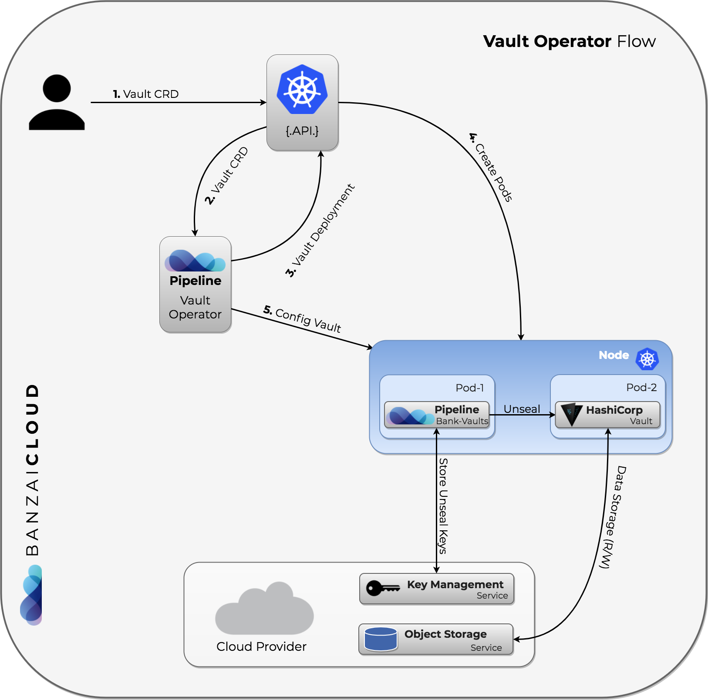

[](https://hub.docker.com/r/banzaicloud/bank-vaults/)
[](https://godoc.org/github.com/banzaicloud/bank-vaults)
[](https://circleci.com/gh/banzaicloud/bank-vaults/tree/master)
[](https://goreportcard.com/report/github.com/banzaicloud/bank-vaults)

*Bank Vaults is a thick, tricky, shifty right with a fast and intense tube for experienced surfers only, located on Mentawai. Think heavy steel doors, secret unlocking combinations and burly guards with smack-down attitude. Watch out for clean-up sets.*

*Bank Vaults is a wrapper for the official Vault client with automatic token renewal, built in Kubernetes support, dynamic database credential management, multiple unseal options, automatic re/configuration and more.*

---

**Bank Vaults** is a core building block of the **[Pipeline](https://github.com/banzaicloud/pipeline)** PaaS. Some of the usage patterns are highlighted through these blog posts:

**Securing Kubernetes deployments with Vault:**

- [Authentication and authorization of Pipeline users with OAuth2 and Vault](https://banzaicloud.com/blog/oauth2-vault/)
- [Dynamic credentials with Vault using Kubernetes Service Accounts](https://banzaicloud.com/blog/vault-dynamic-secrets/)
- [Dynamic SSH with Vault and Pipeline](https://banzaicloud.com/blog/vault-dynamic-ssh/)
- [Secure Kubernetes Deployments with Vault and Pipeline](https://banzaicloud.com/blog/hashicorp-guest-post/)
- [Vault Operator](https://banzaicloud.com/blog/vault-operator/)
- [Vault unseal flow with KMS](https://banzaicloud.com/blog/vault-unsealing/)

We use Vault across our large Kubernetes deployments and all the projects were `reinventing` the wheel. We have externalized all the codebase into this project and removed all the [Pipeline](https://github.com/banzaicloud/pipeline) and [Hollowtrees](https://github.com/banzaicloud/hollowtrees) dependencies thus this project can be used independently as a CLI tool to manage Vault, a Golang library to build upon (OAuth2 tokens, K8s auth, Vault operator, dynamic secrets, cloud credential storage, etc), Helm chart for a HA cluster, operator and a collection of scripts to support some advanced features (dynamic SSH, etc).

>We take bank-vaults' security and our users' trust very seriously. If you believe you have found a security issue in bank-vaults, please contact us at security@banzaicloud.com.

## Table of Contents

- [The CLI tool](#the-cli-tool)
- [The Go library](#the-go-library)
- [Helm Chart](#helm-chart)
- [Operator](#operator)
- [Examples](#examples)
- [Getting and Installing](#getting-and-installing)
- [Monitoring](#monitoring)
- [Contributing](#contributing)
- [Credits](#credits)

## The CLI tool

The `bank-vaults` CLI tool is to help automate the setup and management of HashiCorp Vault.

Features:

- Initializes Vault and stores the root token and unseal keys in one of the followings:
  - AWS KMS keyring (backed by S3)
  - Azure Key Vault
  - Google Cloud KMS keyring (backed by GCS)
  - Alibaba Cloud KMS (backed by OSS)
  - Kubernetes Secrets (should be used only for development purposes)
  - Dev Mode (useful for `vault server -dev` dev mode Vault servers)
- Automatically unseals Vault with these keys
- Continuously configures Vault with a YAML/JSON based external configuration (besides the [standard Vault configuration](https://www.vaultproject.io/docs/configuration/index.html))
  - If the configuration is updated Vault will be reconfigured
  - It supports configuring Vault secret engines, plugins, auth methods, and policies

### Example external Vault configuration

```yaml
# Allows creating policies in Vault which can be used later on in roles
# for the Kubernetes based authentication.
# See https://www.vaultproject.io/docs/concepts/policies.html for more information.
policies:
  - name: allow_secrets
    rules: path "secret/*" {
             capabilities = ["create", "read", "update", "delete", "list"]
           }

# Allows configuring Auth Methods in Vault (Kubernetes and GitHub is supported now).
# See https://www.vaultproject.io/docs/auth/index.html for more information.
auth:
  - type: kubernetes
    # If you want to configure with specific kubernets service account instead of default service account
    # https://www.vaultproject.io/docs/auth/kubernetes.html
    # config:
    #  token_reviewer_jwt: your_service_account_jwt
    #  kubernetes_ca_cert: -----BEGIN CERTIFICATE-----.....-----END CERTIFICATE-----
    #  kubernetes_host: https://192.168.99.100:8443
    # Allows creating roles in Vault which can be used later on for the Kubernetes based
    # authentication.
    #  See https://www.vaultproject.io/docs/auth/kubernetes.html#creating-a-role for
    # more information.
    roles:
      # Allow every pod in the default namespace to use the secret kv store
      - name: default
        bound_service_account_names: default
        bound_service_account_namespaces: default
        policies: allow_secrets
        ttl: 1h

  # Allows creating team mappings in Vault which can be used later on for the GitHub
  # based authentication.
  # See https://www.vaultproject.io/docs/auth/github.html#configuration for
  # more information.
  - type: github
    config:
      organization: banzaicloud
    map:
      # Map the banzaicloud dev team on GitHub to the dev policy in Vault
      teams:
        dev: dev
      # Map myself to the root policy in Vault
      users:
        bonifaido: allow_secrets

  # Allows creating roles in Vault which can be used later on for AWS
  # IAM based authentication.
  # See https://www.vaultproject.io/docs/auth/aws.html for
  # more information.
  - type: aws
    config:
      access_key: VKIAJBRHKH6EVTTNXDHA
      secret_key: vCtSM8ZUEQ3mOFVlYPBQkf2sO6F/W7a5TVzrl3Oj
      iam_server_id_header_value: vault-dev.example.com # consider setting this to the Vault server's DNS name
    crossaccountrole:
    # Add cross account number and role to assume in the cross account
    # https://www.vaultproject.io/api/auth/aws/index.html#create-sts-role
    - sts_account: 12345671234
      sts_role_arn: arn:aws:iam::12345671234:role/crossaccountrole
    roles:
    # Add roles for AWS instances or principals
    # See https://www.vaultproject.io/api/auth/aws/index.html#create-role
    - name: dev-role-iam
      bound_iam_principal_arn: arn:aws:iam::123456789012:role/dev-vault
      policies: allow_secrets
      period: 1h
    - name: cross-account-role
      bound_iam_principal_arn: arn:aws:iam::12345671234:role/crossaccountrole
      policies: allow_secrets
      period: 1h

  # Allows creating group mappings in Vault which can be used later on for the LDAP
  # based authentication.
  # See https://www.vaultproject.io/docs/auth/ldap.html#configuration for
  # more information.
  # Start an LDAP testing server: docker run -it --rm -p 389:389 -e LDAP_TLS=false --name ldap osixia/openldap
  # Start an LDAP admin server: docker run -it --rm -p 6443:443 --link ldap:ldap -e PHPLDAPADMIN_LDAP_HOSTS=ldap -e PHPLDAPADMIN_LDAP_CLIENT_TLS=false osixia/phpldapadmin
  - type: ldap
    description: LDAP directory auth.
    config:
      url: ldap://localhost
      binddn: "cn=admin,dc=example,dc=org"
      bindpass: "admin"
      userattr: uid
      userdn: "ou=users,dc=example,dc=org"
      groupdn: "ou=groups,dc=example,dc=org"
    groups:
      # Map the banzaicloud dev team on GitHub to the dev policy in Vault
      developers:
        policies: allow_secrets
    # Map myself to the allow_secrets policy in Vault
    users:
      bonifaido:
        groups: developers
        policies: allow_secrets

# Allows configuring Secrets Engines in Vault (KV, Database and SSH is tested,
# but the config is free form so probably more is supported).
# See https://www.vaultproject.io/docs/secrets/index.html for more information.
secrets:
  # This plugin stores arbitrary secrets within the configured physical storage for Vault.
  # See https://www.vaultproject.io/docs/secrets/kv/index.html for
  # more information.
  - path: secret
    type: kv
    description: General secrets.
    options:
      version: 2
  # Mounts non-default plugin's path
  - path: ethereum-gateway
    type: plugin
    plugin_name: ethereum-plugin
    description: Immutability's Ethereum Wallet
# Registers a new plugin in Vault's plugin catalog. "plugin_directory" setting should be set it Vault server configuration and plugin binary should be present in plugin directory. Also, for some plugins readOnlyRootFilesystem Pod Security Policy should be disabled to allow RPC communication between plugin and Vault server via Unix socket
# See https://www.vaultproject.io/api/system/plugins-catalog.html and https://github.com/hashicorp/go-plugin/blob/master/docs/internals.md for details.
plugins:
  - plugin_name: ethereum-plugin
    command: ethereum-vault-plugin --ca-cert=/vault/tls/client/ca.crt --client-cert=/vault/tls/server/server.crt --client-key=/vault/tls/server/server.key
    sha256: 62fb461a8743f2a0af31d998074b58bb1a589ec1d28da3a2a5e8e5820d2c6e0a

  # This plugin stores database credentials dynamically based on configured roles for
  # the MySQL database.
  # See https://www.vaultproject.io/docs/secrets/databases/mysql-maria.html for
  # more information.
  - type: database
    description: MySQL Database secret engine.
    configuration:
      config:
        - name: my-mysql
          plugin_name: "mysql-database-plugin"
          connection_url: "{{username}}:{{password}}@tcp(127.0.0.1:3306)/"
          allowed_roles: [pipeline]
          username: "${env "ROOT_USERNAME"}" # Example how to read environment variables
          password: "${env "ROOT_PASSWORD"}"
      roles:
        - name: pipeline
          db_name: my-mysql
          creation_statements: "GRANT ALL ON *.* TO '{{name}}'@'%' IDENTIFIED BY '{{password}}';"
          default_ttl: "10m"
          max_ttl: "24h"

  # Create a named Vault role for signing SSH client keys.
  # See https://www.vaultproject.io/docs/secrets/ssh/signed-ssh-certificates.html#client-key-signing for
  # more information.
  - type: ssh
    path: ssh-client-signer
    description: SSH Client Key Signing.
    configuration:
      config:
        - name: ca
          generate_signing_key: "true"
      roles:
        - name: my-role
          allow_user_certificates: "true"
          allowed_users: "*"
          key_type: "ca"
          default_user: "ubuntu"
          ttl: "24h"

  # The RabbitMQ secrets engine generates user credentials dynamically based on configured permissions and virtual hosts.
  # See https://www.vaultproject.io/docs/secrets/rabbitmq/index.html
  # Start a RabbitMQ testing server: docker run -it --rm -p 15672:15672 rabbitmq:3.7-management-alpine
  - type: rabbitmq
    description: local-rabbit
    configuration:
      config:
        - name: connection
          connection_uri: "http://localhost:15672"
          username: guest
          password: guest
      roles:
        - name: prod_role
          vhosts: '{"/web":{"write": "production_.*", "read": "production_.*"}}'

  # The PKI secrets engine generates X.509 certificates
  # See https://www.vaultproject.io/docs/secrets/pki/index.html for more information
  - type: pki
    description: Vault PKI Backend
    options:
      default_ttl: 168h
      max_ttl: 720h
    configuration:
      config:
      - name: urls
        issuing_certificates: https://vault.default:8200/v1/pki/ca
        crl_distribution_points: https://vault.default:8200/v1/pki/crl
      root/generate:
      - name: internal
        common_name: vault.default
      roles:
      - name: default
        allowed_domains: localhost,pod,svc,default
        allow_subdomains: true
        generate_lease: true
        ttl: 30m
```

## The Go library

This repository contains several Go packages for interacting with Vault:

- `pkg/auth`

    A GitHub OAuth2 based authentication system as a Gin Middleware, stores JWT bearer tokens in Vault.

    

- `pkg/vault`

    A wrapper for the official Vault client with automatic token renewal, and Kubernetes support.

    

- `pkg/db`

    A helper for creating database source strings (MySQL/PostgreSQL) with database credentials dynamically based on configured Vault roles (instead of `username:password`).

    

- `pkg/tls`

    A simple package to generate self-signed TLS certificates. Useful for bootstrapping situations, when you can't use Vault's [PKI secret engine](https://www.vaultproject.io/docs/secrets/pki/index.html).

## Helm Chart

We have a fully fledged, production ready [Helm chart](https://github.com/banzaicloud/banzai-charts/tree/master/vault) for Vault using `bank-vaults`. With the help of this chart you can run a HA Vault instance with automatic initialization, unsealing and external configuration which used to be a tedious manual operation. This chart can be used easily for development purposes as well.

## Operator

We have a Vault operator built on bank-vaults features as:

- external, API based configuration (secret engines, auth methods, policies) to automatically re/configure a Vault cluster
- automatic unsealing (AWS, GCE, Azure, Alibaba, Kubernetes Secrets (for dev purposes), Oracle)
- TLS support

The operator flow is the following:



The source code can be found inside the [operator](operator/) directory.

### Deploying the operator

```bash
kubectl apply -f operator/deploy/rbac.yaml
kubectl apply -f operator/deploy/operator.yaml
```

This will create a Kubernetes [CustomResourceDefinition](https://kubernetes.io/docs/tasks/access-kubernetes-api/extend-api-custom-resource-definitions/) called `Vault`.

A documented example of this CRD can be found in [operator/deploy/cr.yaml](operator/deploy/cr.yaml).

## Keys

The keys that will be stored are:

- `vault-root`, which is the Vault's root token
- `vault-unseal-N`, where `N` is a number, starting at 0 up to the maximum defined minus 1, e.g. 5 unseal keys will be `vault-unseal-0` up to including `vault-unseal-4`

HashiCorp [recommends to revoke root tokens](https://www.vaultproject.io/docs/concepts/tokens.html#root-tokens) after the initial set up of Vault has been completed.
To unseal Vault the `vault-root` token is not needed and can be removed from the storage if it was put there via the `--init` call to `bank-vaults`.

## Examples for using the library part

Some examples are in `cmd/examples/main.go`

- [Vault client example](https://github.com/banzaicloud/bank-vaults/blob/master/cmd/examples/main.go#L17)
- [Dynamic secrets for MySQL example with Gorm](https://github.com/banzaicloud/bank-vaults/blob/master/cmd/examples/main.go#L45)
- [JWTAuth tokens example with a Gin middleware](https://github.com/banzaicloud/bank-vaults/blob/master/cmd/examples/main.go#L53)

## Getting and Installing

```bash
go get github.com/banzaicloud/bank-vaults/cmd/bank-vaults
```

or

```bash
docker pull banzaicloud/bank-vaults
docker pull banzaicloud/vault-operator
```

## Monitoring

At Banzai Cloud we prefer Prometheus for monitoring and use it also for Vault. If you configure, Vault can expose metrics through [statsd](https://www.vaultproject.io/docs/configuration/telemetry.html#statsd). Both the [Helm chart](https://github.com/banzaicloud/banzai-charts/tree/master/vault) and the Vault Operator installs the [Prometheus StatsD exporter](https://github.com/prometheus/statsd_exporter) and annotates the pods correctly with Prometheus annotations so Prometheus can discover and scrape them. All you have to do is to put the telemetry stanza into your Vault configuration:

```yaml
    telemetry:
      statsd_address: localhost:9125
```

## Cloud permissions

The `bank-vaults` CLI command needs certain cloud permissions to function properly (init, unseal, configuration).

### Google Cloud

The Service Account in which the Pod is running has to have the following IAM Roles:

- Cloud KMS Admin
- Cloud KMS CryptoKey Encrypter/Decrypter
- Storage Admin

A CLI example how to run bank-vaults based Vault configuration on Google Cloud:

```bash
bank-vaults configure --google-cloud-kms-key-ring vault --google-cloud-kms-crypto-key bank-vaults --google-cloud-kms-location global --google-cloud-storage-bucket vault-ha --google-cloud-kms-project continual-flow-276578
```

### Azure

The Access Policy in which the Pod is running has to have the following IAM Roles:

- Key Vault All Key permissions
- Key Vault All Secret permissions

### AWS

The Instance profile in which the Pod is running has to have the following IAM Policies:

- KMS: `kms:Encrypt, kms:Decrypt`
- S3:  `s3:GetObject, s3:PutObject`

An example command how to init and unseal Vault on AWS:

```bash
bank-vaults unseal --init --mode aws-kms-s3 --aws-kms-key-id 9f054126-2a98-470c-9f10-9b3b0cad94a1 --aws-s3-region eu-west-1 --aws-kms-region eu-west-1 --aws-s3-bucket bank-vaults
```

When using existing unseal keys, you need to make sure to kms encrypt these with the proper `EncryptionContext`.
If this is not done, the invocation of `bank-vaults` will trigger an `InvalidCiphertextException` from AWS KMS.
An example how to encrypt the keys (specify `--profile` and `--region` accordingly):

```bash
aws kms encrypt --key-id "alias/kms-key-alias" --encryption-context "Tool=bank-vaults"  --plaintext fileb://vault-unseal-0.txt --output text --query CiphertextBlob | base64 -D > vault-unseal-0
```

From this point on copy the encrypted files to the appropriate S3 bucket.
As an additional security measure make sure to turn on encryption of the S3 bucket before uploading the files.

### Alibaba Cloud

A CLI example how to run bank-vaults based Vault unsealing on Alibaba Cloud:

```bash
bank-vaults unseal --mode alibaba-kms-oss --alibaba-access-key-id ${ALIBABA_ACCESS_KEY_ID} --alibaba-access-key-secret ${ALIBABA_ACCESS_KEY_SECRET} --alibaba-kms-region eu-central-1 --alibaba-kms-key-id ${ALIBABA_KMS_KEY_UUID} --alibaba-oss-endpoint oss-eu-central-1.aliyuncs.com --alibaba-oss-bucket bank-vaults
```

### Kubernetes

The Service Account in which the Pod is running has to have the following Roles rules:

```yaml
rules:
- apiGroups: [""]
  resources: ["secrets"]
  verbs:     ["get", "create", "update"]
```

### Contributing

If you find this project useful here's how you can help:

- Send a pull request with your new features and bug fixes
- Help new users with issues they may encounter
- Support the development of this project and star this repo!

## Credits

Kudos to HashiCorp for open sourcing Vault and making secret management easier and more secure.

## License

Copyright (c) 2017-2018 [Banzai Cloud, Inc.](https://banzaicloud.com)

Licensed under the Apache License, Version 2.0 (the "License");
you may not use this file except in compliance with the License.
You may obtain a copy of the License at

[http://www.apache.org/licenses/LICENSE-2.0](http://www.apache.org/licenses/LICENSE-2.0)

Unless required by applicable law or agreed to in writing, software
distributed under the License is distributed on an "AS IS" BASIS,
WITHOUT WARRANTIES OR CONDITIONS OF ANY KIND, either express or implied.
See the License for the specific language governing permissions and
limitations under the License.
