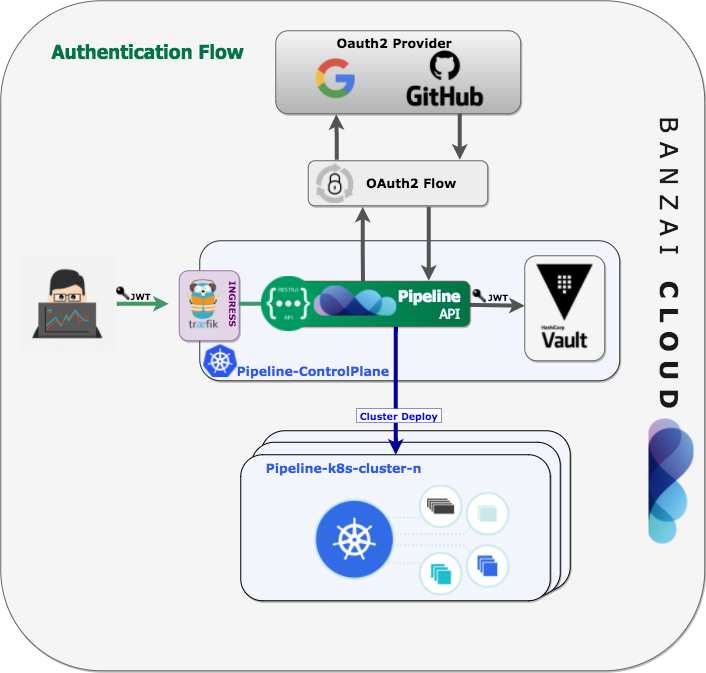
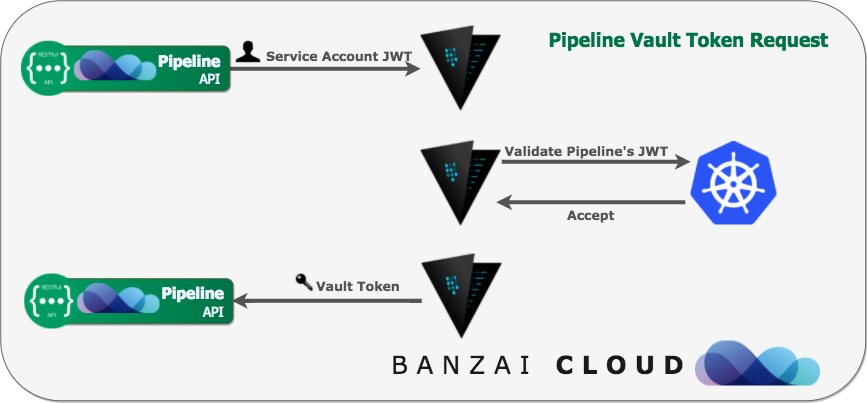

[](https://hub.docker.com/r/banzaicloud/bank-vaults/)
[](https://godoc.org/github.com/banzaicloud/bank-vaults)

*Bank Vaults is a thick, tricky, shifty right with a fast and intense tube for experienced surfers only, located on Mentawai. Think heavy steel doors, secret unlocking combinations and burly guards with smack-down attitude. Watch out for clean-up sets.*

*Bank Vaults is a wrapper for the official Vault client with automatic token renewal, built in Kubernetes support, dynamic database credential management and more.*

---

**Bank Vaults** is a core building block of the [Pipeline](https://github.com/banzaicloud/pipeline) PaaS. Some of the usage patterns are highlighted through these blog posts:

**Securing Kubernetes deployments with Vault:**
- [Authentication and authorization of Pipeline users with OAuth2 and Vault](https://banzaicloud.com/blog/oauth2-vault/)
- [Dynamic credentials with Vault using Kubernetes Service Accounts](https://banzaicloud.com/blog/vault-dynamic-secrets/)
- [Dynamic SSH with Vault and Pipeline](https://banzaicloud.com/blog/vault-dynamic-ssh/)

## Table of Contents

- [The CLI tool](#the-cli-tool)
  * [Example external Vault configuration](#example-external-vault-configuration)
- [The Go library](#the-go-library)
- [Helm Chart](#helm-chart)
- [Examples](#examples)
- [Getting and Installing](#getting-and-installing)

## The CLI tool

The `bank-vaults` CLI tool is to help automate the setup and management of Hashicorp Vault.

Features:
 - Initializes Vault and stores the root token and unseal keys in one of the followings:
    - AWS KMS keyring (backed by S3)
    - Azure Key Vault
    - Google Cloud KMS keyring (backed by GCS)
    - Kubernetes Secrets (should be used only for development purposes)
 - Automatically unseals Vault with these keys
 - Continiously configures Vault with a YAML/JSON based external configuration (besides the [standard Vault configuration](https://www.vaultproject.io/docs/configuration/index.html))
    - If the configuration is updated Vault will be reconfigured
    - It supports configuring Vault secret engines, auth methods, and policies

### Example external Vault configuration
```yaml
# Allows creating policies in Vault which can be used later on in roles
# for the Kubernetes based authentication.
# See https://www.vaultproject.io/docs/concepts/policies.html for more information.
policies:
  - name: allow_secrets
    rules: path "secret/*" {
             capabilities = ["create", "read", "update", "delete", "list"]
           }
auth:
  - type: kubernetes
    # Allows creating roles in Vault which can be used later on for the Kubernetes based
    # authentication.
    # See https://www.vaultproject.io/docs/auth/kubernetes.html#creating-a-role for
    # more information.
    roles:
      # Allow every pod in the default namespace to use the secret kv store
      - name: default
        bound_service_account_names: default
        bound_service_account_namespaces: default
        policies: allow_secrets
        ttl: 1h
secrets:
  - path: secret
    type: kv
    description: General secrets.
    options:
      version: 1
  # This plugin generates database credentials dynamically based on configured roles for
  # the MySQL database.
  # See https://www.vaultproject.io/docs/secrets/databases/mysql-maria.html for
  # more information.
  - type: database
    description: Database secret engine.
    configuration:
      config:
        - name: my-mysql
          plugin_name: "mysql-database-plugin"
          connection_url: "{{username}}:{{password}}@tcp(127.0.0.1:3306)/"
          allowed_roles: [pipeline]
          username: "${env "ROOT_USERNAME"}" # Example how to refer to environment variables
          password: "${env "ROOT_PASSWORD"}"
      roles:
        - name: pipeline
          db_name: my-mysql
          creation_statements: "GRANT ALL ON *.* TO '{{name}}'@'%' IDENTIFIED BY '{{password}}';"
          default_ttl: "10m"
          max_ttl: "24h"
```

## The Go library

This repository contains several Go packages for interacting with Vault:

- `auth`

    *Note: This is currently WIP, we are extracting the code from https://github.com/banzaicloud/pipeline/tree/master/auth*</br>
    A GitHub OAuth2 based authentication system as a Gin Middleware, stores JWT beaerer tokens in Vault.

    

- `vault`

    A wrapper for the official Vault client with automatic token renewal, and Kubernetes support.

    

- `database`

    A helper for creating database source strings (MySQL/PostgreSQL) with database credentials dynamically based on configured Vault roles (instead of `username:password`).

    

## Helm Chart

We have a fully fladged, production ready [Helm chart](https://github.com/banzaicloud/banzai-charts/tree/master/stable/vault) for Vault using `bank-vaults`. With the help of this chart you can run a HA Vault instance with automatic initialization, unsealing and external configuration which used to be a tedious manual operation. This chart can be used easily for development purposes as well.

## Examples

Some examples are in `cmd/examples/main.go`

## Getting and Installing

```bash
go get github.com/banzaicloud/bank-vaults/cmd/bank-vaults
```
