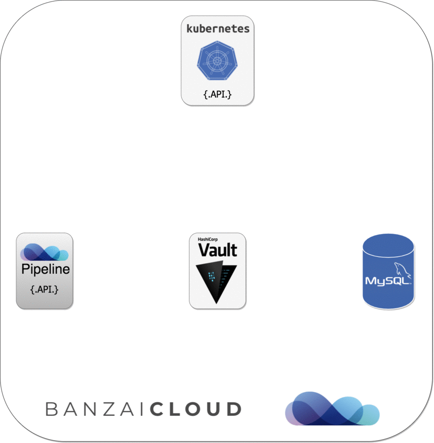

[](https://hub.docker.com/r/banzaicloud/bank-vaults/)
[](https://godoc.org/github.com/banzaicloud/bank-vaults)
[](https://circleci.com/gh/banzaicloud/bank-vaults/tree/master)

*Bank Vaults is a thick, tricky, shifty right with a fast and intense tube for experienced surfers only, located on Mentawai. Think heavy steel doors, secret unlocking combinations and burly guards with smack-down attitude. Watch out for clean-up sets.*

*Bank Vaults is a wrapper for the official Vault client with automatic token renewal, built in Kubernetes support, dynamic database credential management, multiple unseal options, automatic re/configuration and more.*

---

**Bank Vaults** is a core building block of the **[Pipeline](https://github.com/banzaicloud/pipeline)** PaaS. Some of the usage patterns are highlighted through these blog posts:

**Securing Kubernetes deployments with Vault:**
- [Authentication and authorization of Pipeline users with OAuth2 and Vault](https://banzaicloud.com/blog/oauth2-vault/)
- [Dynamic credentials with Vault using Kubernetes Service Accounts](https://banzaicloud.com/blog/vault-dynamic-secrets/)
- [Dynamic SSH with Vault and Pipeline](https://banzaicloud.com/blog/vault-dynamic-ssh/)
- [Secure Kubernetes Deployments with Vault and Pipeline](https://banzaicloud.com/blog/hashicorp-guest-post/)
- [Vault Operator](https://banzaicloud.com/blog/vault-operator/)

We use Vault across our large Kubernetes deployments and all the projects were `reinventing` the wheel. We have externalized all the codebase into this project and removed all the [Pipeline](https://github.com/banzaicloud/pipeline) and [Hollowtrees](https://github.com/banzaicloud/hollowtrees) dependencies thus this project can be used independently as a CLI tool to manage Vault, a Golang library to build upon (OAuth2 tokens, K8s auth, Vault operator, dynamic secrets, cloud credential storage, etc), Helm chart for a HA cluster, operator and a collection of scripts to support some advanced features (dynamic SSH, etc). 

>We take bank-vaults' security and our users' trust very seriously. If you believe you have found a security issue in bank-vaults, please contact us at security@banzaicloud.com.

## Table of Contents

- [The CLI tool](#the-cli-tool)
- [The Go library](#the-go-library)
- [Helm Chart](#helm-chart)
- [Operator](#operator)
- [Examples](#examples)
- [Getting and Installing](#getting-and-installing)
- [Credits](#credits)

## The CLI tool

The `bank-vaults` CLI tool is to help automate the setup and management of HashiCorp Vault.

Features:
 - Initializes Vault and stores the root token and unseal keys in one of the followings:
    - AWS KMS keyring (backed by S3)
    - Azure Key Vault
    - Google Cloud KMS keyring (backed by GCS)
    - Kubernetes Secrets (should be used only for development purposes)
    - Dev Mode (useful for `vault server -dev` dev mode Vault servers)
 - Automatically unseals Vault with these keys
 - Continuously configures Vault with a YAML/JSON based external configuration (besides the [standard Vault configuration](https://www.vaultproject.io/docs/configuration/index.html))
    - If the configuration is updated Vault will be reconfigured
    - It supports configuring Vault secret engines, auth methods, and policies

### Example external Vault configuration
```yaml
# Allows creating policies in Vault which can be used later on in roles
# for the Kubernetes based authentication.
# See https://www.vaultproject.io/docs/concepts/policies.html for more information.
policies:
  - name: allow_secrets
    rules: path "secret/*" {
             capabilities = ["create", "read", "update", "delete", "list"]
           }

# Allows configuring Auth Methods in Vault (Kubernetes and GitHub is supported now).
# See https://www.vaultproject.io/docs/auth/index.html for more information.
auth:
  # Allows creating roles in Vault which can be used later on for the Kubernetes based
  # authentication.
  # See https://www.vaultproject.io/docs/auth/kubernetes.html#creating-a-role for
  # more information.
  - type: kubernetes
    roles:
      # Allow every pod in the default namespace to use the secret kv store
      - name: default
        bound_service_account_names: default
        bound_service_account_namespaces: default
        policies: allow_secrets
        ttl: 1h

  # Allows creating team mappings in Vault which can be used later on for the GitHub 
  # based authentication.
  # See https://www.vaultproject.io/docs/auth/github.html#configuration for
  # more information.
  - type: github
    config:
      organization: banzaicloud
    map:
      # Map the banzaicloud dev team on GitHub to the dev policy in Vault
      teams:
        dev: dev
      # Map myself to the root policy in Vault
      users:
        bonifaido: root

  # Allows creating roles in Vault which can be used later on for AWS 
  # IAM based authentication.
  # See https://www.vaultproject.io/docs/auth/aws.html for
  # more information.
  - type: aws
    config:
      access_key: VKIAJBRHKH6EVTTNXDHA
      secret_key: vCtSM8ZUEQ3mOFVlYPBQkf2sO6F/W7a5TVzrl3Oj
      iam_server_id_header_value: vault-dev.example.com # consider setting this to the Vault server's DNS name 
    roles:
    # Add roles for AWS instances or principals
    # See https://www.vaultproject.io/api/auth/aws/index.html#create-role
    - name: dev-role-iam
      bound_iam_principal_arn: arn:aws:iam::123456789012:role/dev-vault
      policies: allow_secrets
      period: 1h

# Allows configuring Secrets Engines in Vault (KV, Database and SSH is tested,
# but the config is free form so probably more is supported).
# See https://www.vaultproject.io/docs/secrets/index.html for more information.
secrets:
  # This plugin stores database credentials dynamically based on configured roles for
  # the MySQL database.
  # See https://www.vaultproject.io/docs/secrets/databases/mysql-maria.html for
  # more information.
  - path: secret
    type: kv
    description: General secrets.
    options:
      version: 1

  # This plugin stores arbitrary secrets within the configured physical storage for Vault.
  # See https://www.vaultproject.io/docs/secrets/kv/index.html for
  # more information.
  - type: database
    description: MySQL Database secret engine.
    configuration:
      config:
        - name: my-mysql
          plugin_name: "mysql-database-plugin"
          connection_url: "{{username}}:{{password}}@tcp(127.0.0.1:3306)/"
          allowed_roles: [pipeline]
          username: "${env "ROOT_USERNAME"}" # Example how to read environment variables
          password: "${env "ROOT_PASSWORD"}"
      roles:
        - name: pipeline
          db_name: my-mysql
          creation_statements: "GRANT ALL ON *.* TO '{{name}}'@'%' IDENTIFIED BY '{{password}}';"
          default_ttl: "10m"
          max_ttl: "24h"

  # Create a named Vault role for signing SSH client keys.
  # See https://www.vaultproject.io/docs/secrets/ssh/signed-ssh-certificates.html#client-key-signing for
  # more information.
  - type: ssh
    path: ssh-client-signer
    description: SSH Client Key Signing.
    configuration:
      config:
        - name: ca
          generate_signing_key: "true"
      roles:
        - name: my-role
          allow_user_certificates: "true"
          allowed_users: "*"
          key_type: "ca"
          default_user: "ubuntu"
          ttl: "24h"
```

## The Go library

This repository contains several Go packages for interacting with Vault:

- `auth`

    *Note: This is currently WIP, we are extracting the code from https://github.com/banzaicloud/pipeline/tree/master/auth*</br>
    A GitHub OAuth2 based authentication system as a Gin Middleware, stores JWT bearer tokens in Vault.

    

- `vault`

    A wrapper for the official Vault client with automatic token renewal, and Kubernetes support.

    

- `database`

    A helper for creating database source strings (MySQL/PostgreSQL) with database credentials dynamically based on configured Vault roles (instead of `username:password`).

    

## Helm Chart

We have a fully fledged, production ready [Helm chart](https://github.com/banzaicloud/banzai-charts/tree/master/stable/vault) for Vault using `bank-vaults`. With the help of this chart you can run a HA Vault instance with automatic initialization, unsealing and external configuration which used to be a tedious manual operation. This chart can be used easily for development purposes as well.

## Operator

We have a Vault operator built on bank-vaults features as:

- TLS support
- external, API based configuration (secret engines, auth methods, policies) to automatically re/configure a Vault cluster
- automatic unsealing (AWS, GCE, Azure, Kubernetes Secrets (for dev purposes), Oracle)

### Deploying the operator

```bash
kubectl apply -f deploy/rbac.yaml
kubectl apply -f deploy/operator.yaml
```

This will createa a Kubernetes [CustomResourceDefinition](https://kubernetes.io/docs/tasks/access-kubernetes-api/extend-api-custom-resource-definitions/) called `Vault`.

A documented example of this CRD can be found in [deploy/cr.yaml](deploy/cr.yaml).

## Examples

Some examples are in `cmd/examples/main.go`

## Getting and Installing

```bash
go get github.com/banzaicloud/bank-vaults/cmd/bank-vaults
```

## Cloud permissions

The `bank-vaults` CLI command needs certain cloud permissions to function properly (init, unseal, configuration).

### Google Cloud

The Service Account in which the Pod is running has to have the following IAM Roles:

- Cloud KMS Admin
- Cloud KMS CryptoKey Encrypter/Decrypter
- Storage Admin

### Azure

The Access Policy in which the Pod is running has to have the following IAM Roles:

- Key Vault All Key permissions
- Key Vault All Secret permissions

### AWS

The Instance profile in which the Pod is running has to have the following IAM Policies:

- KMS: `kms:Encrypt, kms:Decrypt`
- S3:  `s3:GetObject, s3:PutObject`

### Kubernetes

The Service Account in which the Pod is running has to have the following Roles rules:

```yaml
rules:
- apiGroups: [""]
  resources: ["secrets"]
  verbs:     ["get", "create", "update"]
```

## Credits

Kudos to HashiCorp for open sourcing Vault and making secret management easier and more secure. 
