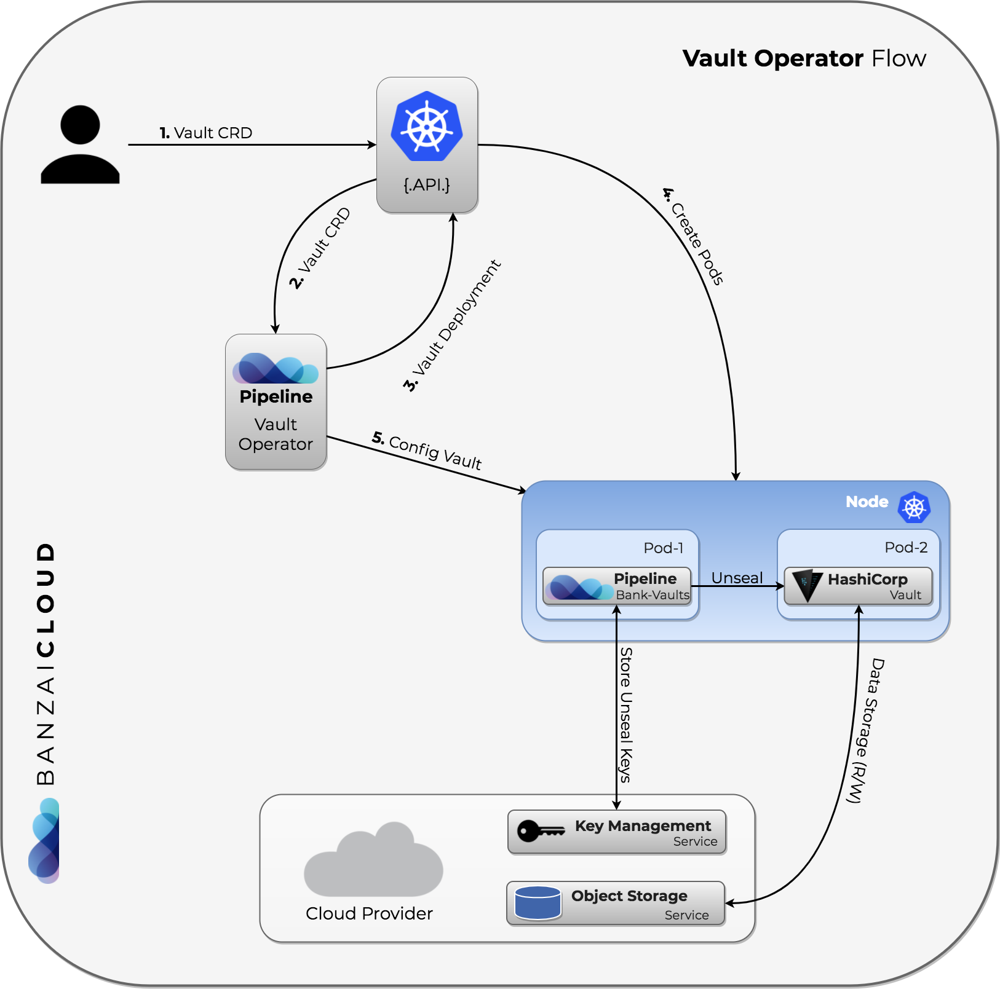

# Operator

We have a Vault operator built on bank-vaults features as:

- external, API based configuration (secret engines, auth methods, policies) to automatically re/configure a Vault cluster
- automatic unsealing (AWS, GCE, Azure, Alibaba, Kubernetes Secrets (for dev purposes), Oracle)
- TLS support

The operator flow is the following:



The source code can be found inside the [operator](https://github.com/banzaicloud/bank-vaults/operator/) directory.

## Deploying the operator

There are two ways to deploy the operator:

### K8s deployment

```bash
kubectl apply -f operator/deploy/rbac.yaml
kubectl apply -f operator/deploy/operator.yaml
```

This will create a Kubernetes [CustomResourceDefinition](https://kubernetes.io/docs/tasks/access-kubernetes-api/extend-api-custom-resource-definitions/) called `Vault`.

A documented example of this CRD can be found in [operator/deploy/cr.yaml](https://github.com/banzaicloud/bank-vaults/blob/master/operator/deploy/cr.yaml).

### Helm chart

There is a Helm chart available to deploy the [Vault Operator](https://github.com/banzaicloud/banzai-charts/tree/master/vault-operator). 

```bash
helm init -c
helm repo add banzaicloud-stable http://kubernetes-charts.banzaicloud.com/branch/master
helm install banzaicloud-stable/vault-operator
```

For further details follow the operator's Helm chart [repository](https://github.com/banzaicloud/banzai-charts/tree/master/vault-operator).
